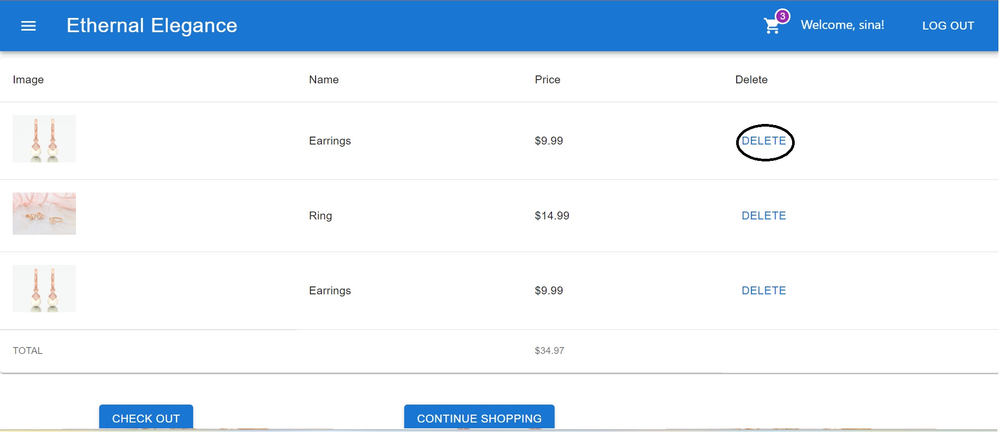

# Eternal Elegance

Eternal Elegance is an e-commerce website for jewelry. The project was created to improve skills in MongoDB, GraphQL, React, Material UI, and other technologies.

## Features

- Landing Page: Displays products and allows users to add items to their cart.
- Login Page: Users are directed here when attempting to access the cart without being logged in. New users can also navigate to the sign-up page.
- Sign-Up Page: Allows users to create a new account.
- Dashboard: After logging in, users can view products and add them to their cart.
- Cart: Users can view the products they have chosen and remove items or continue shopping.
- Checkout: Users can enter address and payment details and complete their purchase. An order confirmation number is displayed at the end.

## Demo





## Demo Video

[Watch the Video](https://drive.google.com/file/d/1HJAMCQEFgOJoFVgDxBUExRcK1U4KhvPK/view)

## Technologies and NPM Packages Used

- Apollo Server: A GraphQL server implementation.
- Bcrypt: Library for hashing passwords.
- Express: Web application framework for Node.js.
- Mongoose: MongoDB object modeling for Node.js.
- Apollo Client: GraphQL client for making queries and mutations from the client side.
- React: JavaScript library for building user interfaces.
- React DOM: Library for rendering React components in the browser.
- React Router DOM: Library for routing in React applications.

## Getting Started

1. Clone the repository:

```shell
git clone https://github.com/your-username/Eternal-elegance.git
```

2. Install the dependencies:

```shell
cd Eternal-elegance
npm install
```

3. Start the development server:

```shell
npm start
```

4. Open your browser and navigate to [http://localhost:3000](http://localhost:3000) to view the application.

## License

This project is licensed under the MIT License. See the [LICENSE](LICENSE) file for details.

```

```
